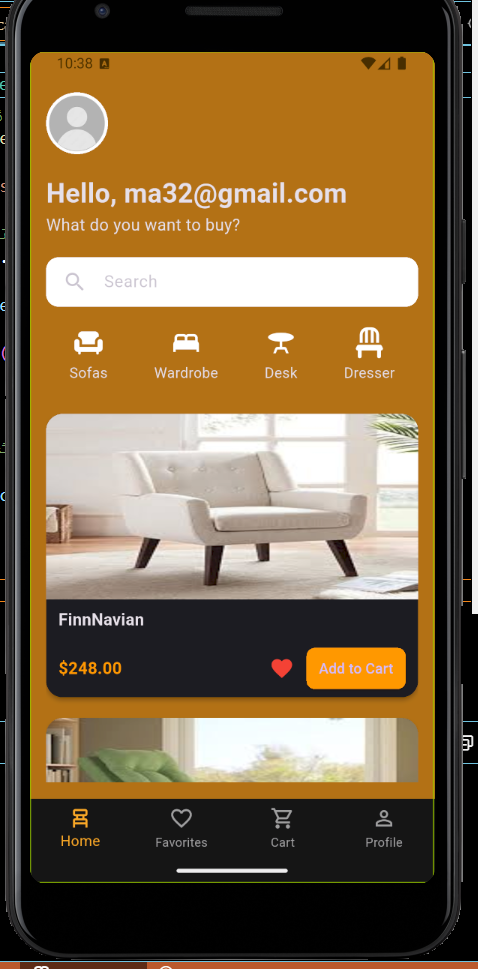
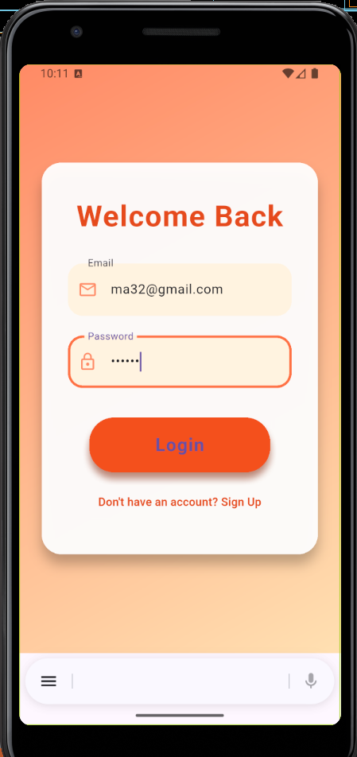

=======
# Graduation_project_iti

# My Flutter App Screenshots

some of screens of my app(Furniture Shop)

## Cart Screens

### Dark Mode Cart

### Cart with Content

### Cart without Content

---

## Favorites Screens

### Dark Mode Favorites

### Favorites View with Items

### Favorites View without Content

---

## Home Screens

### Dark Mode Home

### Home View with Like or Add to Cart

---

## Login Screens

### Login Content

### Login View

---

## Main View

### Main View without Like or Add Cart

---

## Profile Screens

### Dark Mode Profile

### Profile View

---

## Signup Screens

### Signup View

### Signup Content

